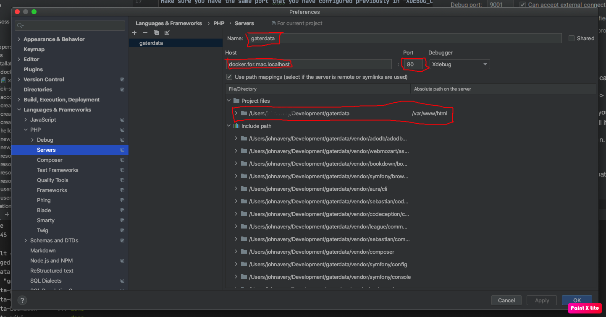

# Configure Xdebug in PhpStorm

Turn on xDebug in ```.env```:

    WITH_XDEBUG=true

rebuild your docker containers

    docker-compose build

## PHPStorm configurations

### Set the port defined in .env

In PhpStorm, go to PhpStorm -> Preferences -> Languages and Frameworks -> PHP -> Debug.

Make sure you have the same port that you have configured previously in "XDEBUG_CONFIG" environment variable:


### Configure a server.

This is how PHPStorm will map the file paths in your local system to the ones in your container.

Go to File -> Settings -> Languages and Frameworks -> PHP -> Servers



Give a name to the server. It should match the value you have defined in your "PHP_IDE_CONFIG" environment variable,
i.e. "apiopenstudio".

The "host" and "port" is how will access your application.
In this case is the host is a mac, in other cases, you should use "localhost".
The default port for xdebug 3 is now 9003.

Set the path mappings to map your local environment project to "/var/www/html" in docker.

Click "Apply" to save your configurations.

### Configure the remote debugger

On the top right, click on "edit configurations":

Click in the green "plus" sign at the top left and select "PHP Remote Debug" from the list.

Now configure it like this:


Make sure you associate it with the previously created "server" definition. Use "PHPSTORM" as idekey.

Your IDE should be now correctly configured. Lets test.

## Links

* [https://dev.to/brpaz/docker-phpstorm-and-xdebug-the-definitive-guide-14og](https://dev.to/brpaz/docker-phpstorm-and-xdebug-the-definitive-guide-14og)
